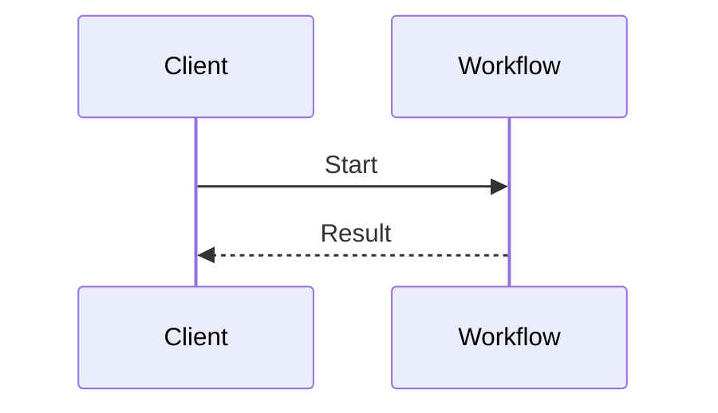

# Contributing to Temporal Design Patterns

This guide covers how to add or improve patterns in this catalog.

## Getting Started

### Prerequisites

Node.js v18 or later.

```bash
npm install          # install dependencies
npm run docs:dev     # start local dev server with hot reload
```

Open `http://localhost:5173/temporal-design-patterns/` to preview the site. The server reloads automatically as you edit files.

## Adding a New Pattern

1. Create `docs/<pattern-name>.md` following the [pattern structure](#pattern-structure) below.
2. Add an entry to the appropriate sidebar section in `docs/.vitepress/config.mts`:

```ts
{ text: 'Your Pattern Name', link: '/your-pattern-name' }
```

### Sidebar Categories

| Category | Current Patterns |
| :--- | :--- |
| Distributed Transaction Patterns | Saga Pattern, Early Return, Idempotent Distributed Transactions |
| Entity & Lifecycle Patterns | Entity Workflow, Continue-As-New, Updatable Timer |
| Workflow Messaging Patterns | Signal with Start, Request-Response via Updates |
| Task Orchestration Patterns | Child Workflows, Parallel Execution, Pick First (Race) |
| External Interaction Patterns | Polling, Long Running Activity, Approval, Delayed Start |
| Worker Configuration Patterns | Worker-Specific Task Queues, Activity Dependency Injection |
| QoS & Throughput Patterns | Rate Limiting, Priority Task Queues, Fairness |

If your pattern does not fit an existing category, propose a new one in your PR description.

## Pattern Structure

Every pattern file must include the following sections **in this order**:

1. **Title** — H1 heading with the pattern name
2. **Overview** — one or two sentences describing what the pattern does
3. **Problem** — the specific problem this pattern solves
4. **Solution** — how the pattern solves the problem, including at least one Mermaid diagram (see [Diagrams](#diagrams))
5. **Implementation** — code examples across supported SDKs using a `:::code-group` tab block
6. **When to use** — conditions under which this pattern is appropriate
7. **Benefits and trade-offs** — what you gain and what you give up
8. **Comparison with alternatives** — how this pattern differs from related approaches
9. **Best practices** — recommendations for production use
10. **Common pitfalls** — mistakes to avoid
11. **Related patterns** — links to patterns that complement or contrast this one
12. **Sample code** — links to runnable sample repositories

## Writing Style

### Voice

Use second person throughout: "you will configure…", "your workflow should…". Do not use first person ("I", "we", "let's").

### Banned Words

The following words and phrases are not allowed anywhere in pattern content:

| Banned | Use instead |
| :--- | :--- |
| simple / simply | *(omit or rephrase)* |
| easy / easily | *(omit or rephrase)* |
| just | *(omit)* |
| straightforward | *(omit or rephrase)* |
| obviously | *(omit)* |
| trivial | *(omit or rephrase)* |
| "dive into" | "explore" or "review" |
| leverage | use |
| utilize | use |
| powerful | describe the capability instead |
| robust | describe the property instead |
| seamless | *(omit or rephrase)* |

Avoid all assumptive or marketing language. Describe capabilities and trade-offs factually.

### Implementation Phases

Use descriptive headings for implementation phases — not numbered step format ("Step 1 — Doing X"). For example:

```markdown
### Define the Workflow Interface
### Configure the Activity Worker
### Handle Compensation Logic
```

## Diagrams

Every pattern must include at least one Mermaid diagram. Place the diagram inside a fenced code block with the `mermaid` language tag:

````markdown

````

Follow every diagram with a numbered narrative walkthrough that explains each step in plain language.

## Validating Your Pattern

Use the `validated-pattern-writing` skill (via GitHub Copilot Chat) to check your draft against the full style guide before submitting:

```
/validated-pattern-writing
```

The skill checks structure, voice, banned words, Temporal terminology, and formatting, then groups findings as **Errors / Warnings / Suggestions**.

To check word count:

```bash
skills/validated-pattern-writing/scripts/wordcount docs/<pattern-name>.md
```

## Submitting a Pull Request

1. Fork the repository and create a branch from `main`.
2. Add your pattern file and sidebar entry.
3. Validate with the `validated-pattern-writing` skill and resolve all Errors.
4. Open a pull request against `main` with a brief description of the pattern and which sidebar category it belongs to.
