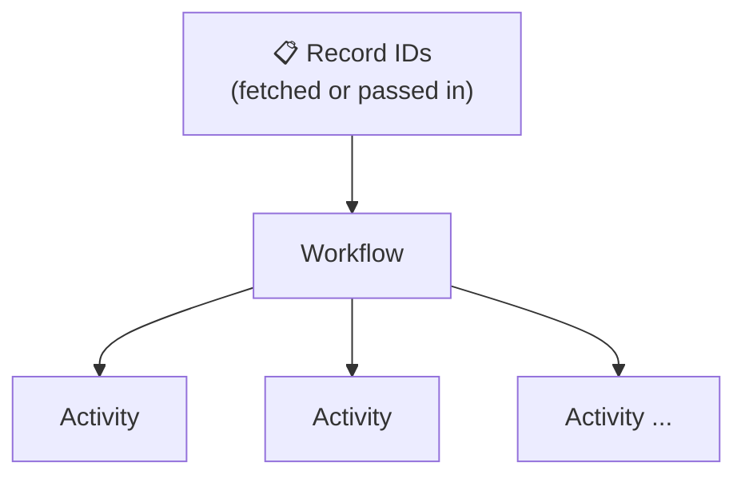
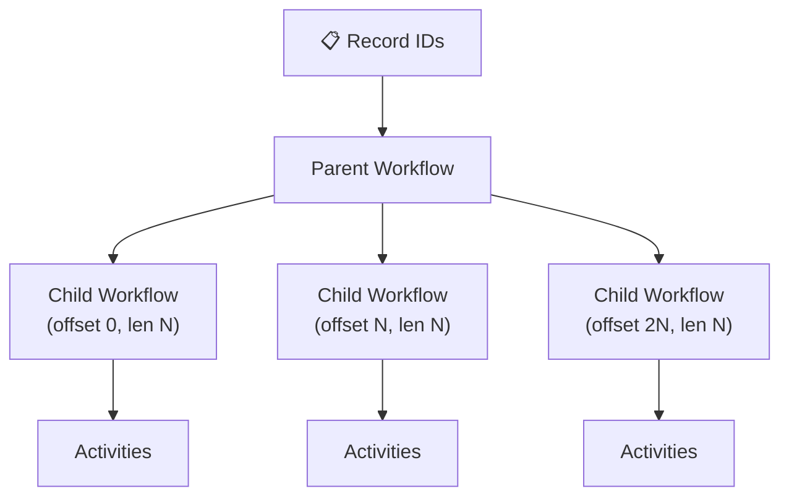
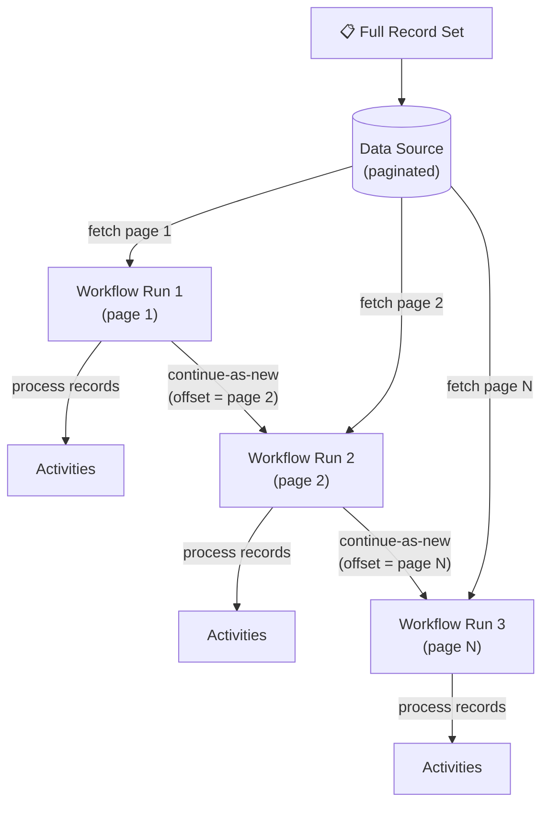
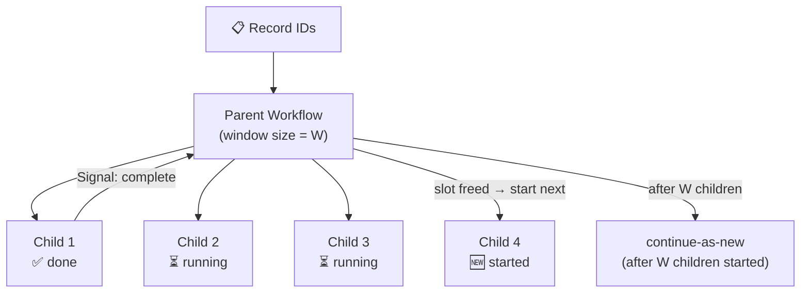
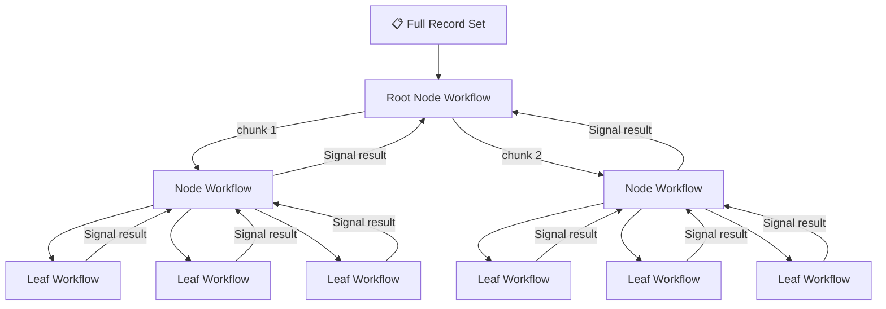

# Batch Workflow Best Practices

---

## Table of Contents

- [Schedules](#schedules)
- [01 Basic Workflow](#01-basic-workflow)
- [02 Fan-Out using Basic Child Workflows](#02-fan-out-using-basic-child-workflows)
- [03 Batch Iterator Workflow](#03-batch-iterator-workflow)
- [04 Sliding Window Workflow](#04-sliding-window-workflow)
- [05 MapReduce Tree](#05-mapreduce-tree)
- [06 Batch Signalling](#06-batch-signalling)
- [07 Limits](#07-limits)

---

## Schedules

Schedules allow Workflows to be executed on a recurring basis. Think of them as a more powerful Cron:

- Supports `start` / `pause` / `stop` / `update` / `backfill` of scheduled workflow executions
- Can have overlapping schedules, configurable with **Overlap Policies**
- Full history visibility
- Schedules can be created via the UI or CLI

**References:**
- https://temporal.io/blog/temporal-schedules-reliable-scalable-and-more-flexible-than-cron-jobs
- https://docs.temporal.io/workflows#schedule
- https://docs.temporal.io/cli/schedule

```bash
$ temporal schedule create \
  --schedule-id 'your-schedule-id' \
  --workflow-id 'your-workflow-id' \
  --task-queue 'your-task-queue' \
  --workflow-type 'YourWorkflowType'
```

---

## 01 Basic Workflow

This is just a standard workflow.

- Workflow fetches, or is started with, record IDs to process
- Runs activity/activities required to retrieve and process each record:
  - Activities can be blocking or non-blocking
  - If non-blocking, the workflow must block to allow all activities to complete
    - **Can only have 2k in-flight activities; ideally limit to 500**
- If the workflow history is likely to exceed 2k events (hard 50k limit), and/or you need Continue-as-New, consider the **Batch Iterator** pattern instead

**Pros:** Simple  
**Cons:** Limited number of records that can be processed; can potentially overwhelm downstream systems; all-or-nothing approach to parallelism



---

## 02 Fan-Out using Basic Child Workflows

Slightly better than the Basic Workflow. Useful when you have between **2K and 4M records**.

- Parent workflow assigns blocks of IDs to child workflows:
  - IDs can be explicit, e.g. `[1, 2, 3, …, n]`
  - Better: use **offset and length**
- Child workflows follow the Basic Workflow pattern
- If the result of processing isn't needed, use `PARENT_CLOSE_POLICY_ABANDON` on child workflows
- If workflow history is likely to exceed 2k events (hard 50k limit), and/or you need Continue-as-New, consider the **Batch Iterator** pattern instead

**Pros:** Relatively simple  
**Cons:** Limited number of records that can be processed; can potentially overwhelm downstream systems; all-or-nothing approach to parallelism



---

## 03 Batch Iterator Workflow

Process a batch of records, then **Continue-as-New** to process the next batch.

- Workflow loads a **page** of record IDs (from an offset)
- Executes child workflows or activities to process each ID in the page
- Calls `continue-as-new` with the last page token / offset:
  - Next run of the workflow does the same with the next page
- Limited parallelism
- Continue-as-New manages event history size

**Reference:** https://github.com/temporalio/samples-java/tree/main/core/src/main/java/io/temporal/samples/batch/iterator

**Pros:** Can rate-limit traffic to downstream systems; no limit to total size of record set  
**Cons:** Batch progresses at the rate of the slowest processor



---

## 04 Sliding Window Workflow

Similar to the Batch Iterator, but maximizes throughput by maintaining a **fixed-size window** of concurrent child workflows. As each child completes, a new one starts immediately for the next record.

- A parent workflow starts a configured number of child workflows in parallel — **one child per record**
- As each child completes, a new one is started for the next record
- Limits the number of concurrent child workflows to prevent overwhelming downstream systems
- The parent calls `continue-as-new` after starting the preconfigured number of children
- A child signals its completion to the parent (since a parent cannot directly wait for a child started by a previous run)

**Reference:** https://github.com/temporalio/samples-java/tree/main/core/src/main/java/io/temporal/samples/batch/slidingwindow

**Pros:** Can rate-limit traffic; no limit to total record set size; window progresses at the rate of the **fastest** processor  
**Cons:** Complicated



---

## 05 MapReduce Tree

Used for **embarrassingly parallel** workloads where speed matters more than rate-limiting.

- Recordset is received by a **Node** workflow
- **Map phase:**
  - If the recordset is small enough to be processed by `n` leaves → start `n` **Leaf** workflows as children
  - Otherwise → split recordset into `n` chunks and pass to `n` **Node** child workflows (recurse)
- **Reduce phase:**
  - Results are signalled from child to parent
  - Parent blocks until all results are received
  - Can be skipped if results aren't needed
- External reads *might* be okay — **avoid external/downstream writes**
- Can be tricky to get correct; track tree depth and fail if too deep
- If rate limiting is needed (e.g. thundering herd), use **Batch Sliding Window** or **Batch Iterator** instead

**Pros:** No limit to total record set size; entire recordset processed in parallel  
**Cons:** Complicated



---

## 06 Batch Signalling

The Temporal CLI batch signal feature notifies multiple workflows with a single command.

**Supported commands:**
- Signal
- Reset
- Cancel
- Terminate

Use by adding the `--query` parameter to the command.

**Limits:**
- 1 running batch job per namespace
- 50 workflows per second per batch

**Reference:** https://docs.temporal.io/cli/batch

```bash
# Terminate all running workflows of a given type
$ temporal workflow terminate \
  --query 'ExecutionStatus = "Running" AND WorkflowType="SomeWorkflowType"' \
  --reason "Terminate Test Workflows Batch"

# Signal all running workflows of a given type
$ temporal workflow signal \
  --workflow-id MyWorkflowId \
  --name MySignal \
  --input '{"Input": "As-JSON"}' \
  --query 'ExecutionStatus = "Running" AND WorkflowType="YourWorkflow"' \
  --reason "Testing"
```

---

## 07 Limits

Key numbers to know. Full reference: https://docs.temporal.io/cloud/limits

| Limit | Value |
|---|---|
| **Actions per second per namespace** | Dynamically allocated based on usage |
| **Unfinished actions per workflow** | 2,000 max (aim for 500). Includes activities, signals, child workflows, cancellation requests |
| **Events per workflow** | 50,000 events max (aim for 2,000) **or** 50MB total history size |
| **Signals per workflow** | 10,000 |
| **Updates per workflow** | 10 in-flight, 2,000 total |
| **Batch signalling** | 1 batch job per namespace; 50 workflows/sec per batch |
