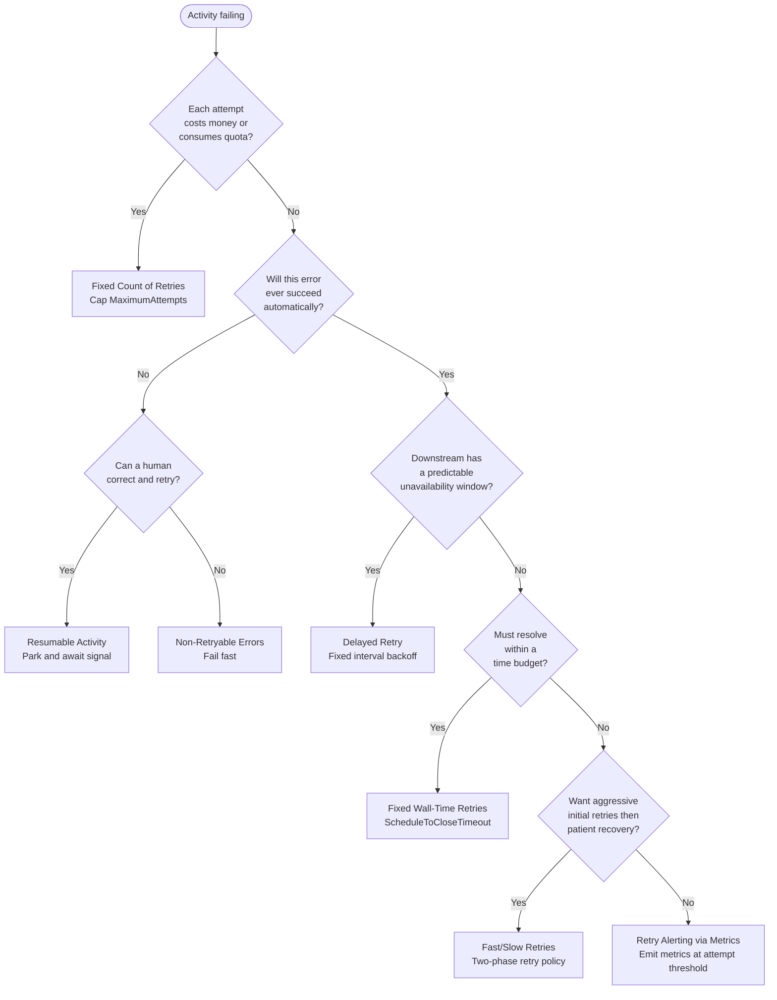

# Error Handling & Retry Patterns

Patterns for controlling how Temporal retries Activities, surfaces persistent failures, and recovers from errors that require human intervention.

<a href="fixed-count-retries">

Fixed Count of Retries

Cap the number of Activity retry attempts to control cost when each attempt consumes a paid or limited resource.

</a>

<a href="fixed-wall-time-retries">

Fixed Wall-Time Retries

Bound the total elapsed time across all retry attempts to enforce a business SLA, regardless of how many individual attempts occur.

</a>

<a href="non-retryable-errors">

Non-Retryable Errors

Mark error types that will never succeed — such as validation failures or missing records — so Temporal fails fast instead of retrying indefinitely.

</a>

<a href="delayed-retry">

Delayed Retry

Use a fixed retry interval when you know the downstream system will be unavailable for a predictable duration, such as a scheduled maintenance window.

</a>

<a href="fast-slow-retries">

Fast/Slow Retries

Try aggressively with a short interval first, then shift to a long interval when fast retries are exhausted, keeping the Workflow alive until the downstream system recovers.

</a>

<a href="retry-metrics">

Retry Alerting via Metrics

Emit a custom metric from inside the Activity when the attempt count crosses a threshold, surfacing silent persistent failures to on-call teams before an SLA breach.

</a>

<a href="resumable-activity">

Resumable Activity

Park the Workflow after retries are exhausted and wait for a human to signal it's ok to proceed or a data correction, then resume execution from where it left off.

</a>

## Choosing the right pattern

The following decision tree helps you select the appropriate retry strategy for your use case.

The following describes each decision point:

1. If each attempt consumes a paid API call, a rate-limited token, or another scarce resource, use **Fixed Count of Retries** to cap total consumption.
2. If the error is structural — a missing record, invalid input, or authorization failure — and cannot be corrected automatically, ask whether a human can fix it: if so, use **Resumable Activity** to park the Workflow and await a correction signal; otherwise use **Non-Retryable Errors** to fail fast.
3. If the downstream system has a scheduled maintenance window and you know approximately how long it will be unavailable, use **Delayed Retry** with a fixed interval.
4. If the process must resolve (one way or another) within a business SLA window such as 24 hours, use **Fixed Wall-Time Retries** with `ScheduleToCloseTimeout`.
5. If you want to recover from transient errors quickly but also wait indefinitely for the downstream system to come back, use **Fast/Slow Retries**.
6. For any long-running retry scenario, add **Retry Alerting via Metrics** to surface persistent failures before they breach an SLA.

## How Temporal retries work

Temporal's default `RetryPolicy` retries Activities indefinitely with exponential backoff.
Unless you configure a policy, a failing Activity will keep retrying until the `ScheduleToCloseTimeout` or the Workflow itself completes.

The key `RetryPolicy` fields are:

| Field | Default | Effect |
| :--- | :--- | :--- |
| `MaximumAttempts` | 0 (unlimited) | Caps total attempts including the first |
| `InitialInterval` | 1 second | Delay before the first retry |
| `BackoffCoefficient` | 2.0 | Multiplier applied after each retry |
| `MaximumInterval` | 100× InitialInterval | Upper bound on the backoff delay |
| `NonRetryableErrorTypes` | `[]` | Error types that skip retries entirely |

`ScheduleToCloseTimeout` is set on the Activity call options, not in `RetryPolicy`.
It caps the total wall-clock time from when the Activity is first scheduled to when it must complete — across all retry attempts.

## Related patterns

- [Long Running Activity](long-running-activity.md): Heartbeating and resumable progress for Activities that run for minutes to hours.
- [Polling External Services](polling.md): Periodic status checks when the downstream system is asynchronous.
- [Approval](approval.md): Human-in-the-loop gate before a Workflow proceeds.

## References

- [Temporal Retry Policies](https://docs.temporal.io/encyclopedia/retry-policies)
- [Understanding Workflow Retries and Failures](https://community.temporal.io/t/understanding-workflow-retries-and-failures/122)
- [Failure Handling in Practice](https://temporal.io/blog/failure-handling-in-practice)
