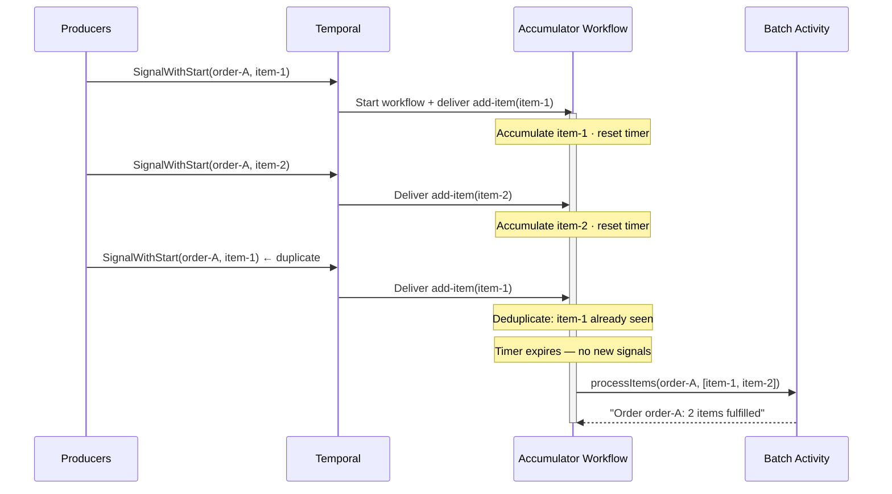

<h1>Event Accumulator Pattern </h1>

:::info TL;DR
Use the Event Accumulator pattern to **durably collect and process events from multiple senders over an unlimited time.** The workflow accumulates signals, deduplicates by a stable item key, and processes the batch after a sliding inactivity timeout — no external coordination, no lost events on retry.
:::

## Overview

The Accumulator pattern groups a stream of incoming events by a key and processes them together as a batch.
A single workflow instance per key receives signals as events arrive, deduplicates them, and waits with a sliding inactivity timer.
When no new events arrive within the timeout window, the workflow calls a batch processing activity and completes.

## Problem

In distributed systems, events for the same logical entity arrive asynchronously from multiple producers at unpredictable rates.
Processing each event individually wastes downstream resources and makes throughput harder to control.
Ensuring exactly one active collector per group key — even under concurrent producers — requires coordination logic that is difficult to build reliably without distributed state.

Without the Accumulator pattern, you must:

- Handle race conditions when multiple producers try to start the same collection workflow simultaneously.
- Implement deduplication externally, because at-least-once delivery is common in event streams.
- Manage a reset timer that extends the collection window each time a new event arrives, without a reliable durable timer primitive.
- Persist collection state externally across restarts and failures.
- Handle gracefully the case where a long accumulation period grows the workflow history beyond safe limits.

## Solution

You assign each group a deterministic workflow ID derived from the group key (for example, `accumulator-order-123`).
Producers call Signal-With-Start so the workflow is created on first use and receives additional signals on subsequent calls — without any client-side coordination.
Inside the workflow, `Workflow.await()` with a timeout implements a sliding inactivity window: each arriving signal resets the countdown.
When the countdown expires — or when an explicit exit signal is sent — the workflow passes all accumulated, deduplicated events to a batch processing activity and completes.
If the accumulation period is long enough to grow the workflow history near its limit, the workflow uses Continue-As-New to carry its state forward into a fresh run.



The following describes each step in the diagram:

1. A producer calls Signal-With-Start with `order-A` as the bucket key. Temporal starts `accumulator-order-A` and delivers the first `add-item` signal. The workflow adds `item-1` to its list and starts the inactivity timer.
2. A second producer calls Signal-With-Start for the same order. Temporal finds the workflow already running and delivers the signal — no new instance is created. The workflow adds `item-2` and resets the timer.
3. The first producer retries `item-1` due to at-least-once delivery. The workflow checks its deduplication set, finds `item-1` already recorded, and discards the duplicate.
4. No new signals arrive within the inactivity window. The `Workflow.await()` condition times out.
5. The workflow calls `processItems` with all accumulated items. The activity returns a result, and the workflow completes.

## Implementation

<DaytonaRunner pattern="event-accumulator" />

The following examples highlight the key mechanics of the accumulator loop.
Full implementations including the worker, starter, and shared types are available in the runner above.

::: code-group

```typescript [TypeScript]
// workflows.ts
export async function accumulatorWorkflow(
  bucketKey: string,
  accumulated: OrderItem[] = [],
  seenKeys: string[] = [],
): Promise<string> {
  const seenSet = new Set(seenKeys);
  const items: OrderItem[] = [...accumulated];
  const unprocessed: OrderItem[] = [];
  let exitRequested = false;

  setHandler(addItemSignal, (item: OrderItem) => {
    unprocessed.push(item);
  });
  setHandler(exitSignal, () => {
    exitRequested = true;
  });

  do {
    // Sliding window: wait for a signal or let the inactivity timer fire
    const timedOut = !(await condition(
      () => unprocessed.length > 0 || exitRequested,
      "10 seconds",
    ));

    // Drain and deduplicate incoming signals
    while (unprocessed.length > 0) {
      const item = unprocessed.shift()!;
      if (item.orderId === bucketKey && !seenSet.has(item.itemId)) {
        seenSet.add(item.itemId);
        items.push(item);
      }
    }

    if (timedOut || exitRequested) {
      const result = await processItems(bucketKey, items);
      if (unprocessed.length === 0) return result;
      // More signals arrived after timeout/exit — loop to process them
    }
  } while (unprocessed.length > 0 || !workflowInfo().continueAsNewSuggested);

  // History growing large — continue as new, carrying accumulated state forward
  await continueAsNew<typeof accumulatorWorkflow>(bucketKey, items, [...seenSet]);
  return ""; // unreachable
}
```

```python [Python]
# workflows.py
@workflow.defn
class AccumulatorWorkflow:
    def __init__(self) -> None:
        self._unprocessed: deque[OrderItem] = deque()
        self._exit_requested = False

    @workflow.signal(name="add-item")
    async def add_item(self, item: OrderItem) -> None:
        self._unprocessed.append(item)

    @workflow.signal(name="exit")
    async def exit_workflow(self) -> None:
        self._exit_requested = True

    @workflow.run
    async def run(
        self,
        bucket_key: str,
        accumulated: list[OrderItem] | None = None,
        seen_keys: list[str] | None = None,
    ) -> str:
        items = list(accumulated or [])
        seen_set = set(seen_keys or [])

        while True:
            # Sliding window: wait for a signal or let the inactivity timer fire
            timed_out = not await workflow.wait_condition(
                lambda: bool(self._unprocessed) or self._exit_requested,
                timeout=timedelta(seconds=10),
            )

            # Drain and deduplicate the signal queue
            while self._unprocessed:
                item = self._unprocessed.popleft()
                if item.order_id == bucket_key and item.item_id not in seen_set:
                    seen_set.add(item.item_id)
                    items.append(item)

            if timed_out or self._exit_requested:
                result = await workflow.execute_activity(
                    process_items,
                    args=[bucket_key, items],
                    start_to_close_timeout=timedelta(seconds=10),
                )
                if not self._unprocessed:
                    return result
                # More signals arrived after timeout/exit — loop to process them

            if workflow.info().is_continue_as_new_suggested():
                workflow.continue_as_new(args=[bucket_key, items, list(seen_set)])
```

```go [Go]
// workflows.go
func AccumulatorWorkflow(ctx workflow.Context, bucketKey string, items []OrderItem, seenKeys []string) (string, error) {
    seenSet := make(map[string]bool)
    for _, k := range seenKeys {
        seenSet[k] = true
    }
    accumulated := append([]OrderItem{}, items...)

    addItemCh := workflow.GetSignalChannel(ctx, "add-item")
    exitCh := workflow.GetSignalChannel(ctx, "exit")
    exitRequested := false

    for {
        // Drain any signals buffered before this iteration
        for {
            var item OrderItem
            if !addItemCh.ReceiveAsync(&item) {
                break
            }
            if item.OrderID == bucketKey && !seenSet[item.ItemID] {
                seenSet[item.ItemID] = true
                accumulated = append(accumulated, item)
            }
        }
        var voidExit interface{}
        if exitCh.ReceiveAsync(&voidExit) {
            exitRequested = true
        }
        if exitRequested {
            break
        }
        if workflow.GetInfo(ctx).ContinueAsNewSuggested {
            keys := make([]string, 0, len(seenSet))
            for k := range seenSet {
                keys = append(keys, k)
            }
            return "", workflow.NewContinueAsNewError(ctx, AccumulatorWorkflow, bucketKey, accumulated, keys)
        }

        // Sliding window: wait for a signal or let the inactivity timer fire
        timedOut := false
        timerCtx, cancelTimer := workflow.WithCancel(ctx)
        timer := workflow.NewTimer(timerCtx, maxAwaitTime)
        selector := workflow.NewSelector(ctx)
        selector.AddFuture(timer, func(f workflow.Future) { timedOut = true })
        selector.AddReceive(addItemCh, func(c workflow.ReceiveChannel, _ bool) {
            var item OrderItem
            c.Receive(ctx, &item)
            if item.OrderID == bucketKey && !seenSet[item.ItemID] {
                seenSet[item.ItemID] = true
                accumulated = append(accumulated, item)
            }
        })
        selector.AddReceive(exitCh, func(c workflow.ReceiveChannel, _ bool) {
            var void interface{}
            c.Receive(ctx, &void)
            exitRequested = true
        })
        selector.Select(ctx)
        cancelTimer() // no-op if timer already fired; cancels timer if a signal arrived

        if timedOut || exitRequested {
            break
        }
    }

    ao := workflow.ActivityOptions{StartToCloseTimeout: 10 * time.Second}
    actCtx := workflow.WithActivityOptions(ctx, ao)
    var result string
    if err := workflow.ExecuteActivity(actCtx, ProcessItems, bucketKey, accumulated).Get(ctx, &result); err != nil {
        return "", err
    }
    workflow.GetLogger(ctx).Info("Processed order batch", "bucketKey", bucketKey, "count", len(accumulated))
    return result, nil
}
```

```java [Java]
// AccumulatorWorkflow.java
@WorkflowInterface
public interface AccumulatorWorkflow {
    @WorkflowMethod
    String accumulate(String bucketKey, List<Shared.OrderItem> items, List<String> seenKeys);

    @SignalMethod
    void addItem(Shared.OrderItem item);

    @SignalMethod
    void exit();

    class Impl implements AccumulatorWorkflow {
        private final Activities activities = Workflow.newActivityStub(
            Activities.class,
            ActivityOptions.newBuilder()
                .setStartToCloseTimeout(Duration.ofSeconds(10))
                .build());

        private final ArrayDeque<Shared.OrderItem> unprocessed = new ArrayDeque<>();
        private boolean exitRequested = false;

        @Override
        public String accumulate(String bucketKey, List<Shared.OrderItem> itemsInput, List<String> seenKeysInput) {
            List<Shared.OrderItem> items = new ArrayList<>(itemsInput);
            Set<String> seenSet = new HashSet<>(seenKeysInput);

            do {
                // Sliding window: wait for a signal or let the inactivity timer fire
                boolean timedOut = !Workflow.await(
                    Shared.MAX_AWAIT_TIME,
                    () -> !unprocessed.isEmpty() || exitRequested);

                // Drain and deduplicate the signal queue
                while (!unprocessed.isEmpty()) {
                    Shared.OrderItem item = unprocessed.removeFirst();
                    if (item.orderId.equals(bucketKey) && seenSet.add(item.itemId)) {
                        items.add(item);
                    }
                }

                if (timedOut || exitRequested) {
                    String result = activities.processItems(bucketKey, items);
                    if (unprocessed.isEmpty()) return result;
                    // More signals arrived after timeout/exit — loop to process them
                }
            } while (!unprocessed.isEmpty() || !Workflow.getInfo().isContinueAsNewSuggested());

            // History growing large — continue as new, carrying accumulated state forward
            AccumulatorWorkflow continueAsNew = Workflow.newContinueAsNewStub(AccumulatorWorkflow.class);
            continueAsNew.accumulate(bucketKey, items, new ArrayList<>(seenSet));
            return ""; // unreachable
        }

        @Override
        public void addItem(Shared.OrderItem item) {
            unprocessed.add(item);
        }

        @Override
        public void exit() {
            exitRequested = true;
        }
    }
}
```

:::

The key differences between SDKs:

- **TypeScript**: Uses `setHandler` to register signal handlers and `condition()` with a string duration for the sliding window. `continueAsNew<typeof accumulatorWorkflow>()` carries accumulated state to the next run.
- **Python**: Uses `@workflow.signal(name=...)` decorators and `workflow.wait_condition()` with a `timedelta` timeout. `workflow.continue_as_new()` accepts the new run arguments.
- **Go**: Uses `workflow.GetSignalChannel` to obtain named signal channels, then builds a `Selector` per iteration with a `NewTimer` future and two channel receivers. Cancels the old timer whenever a signal arrives before it fires.
- **Java**: Uses `@SignalMethod` annotations and `Workflow.await(Duration, Supplier<Boolean>)`. `Workflow.newContinueAsNewStub` carries state to the next run.

Producers in all SDKs call Signal-With-Start to atomically start the workflow if not running and deliver the first signal without any client-side coordination.

## When to use

The Accumulator pattern is well suited when events for the same entity arrive from multiple producers and must be processed together as a batch, when downstream systems perform better with batched calls rather than one call per event, and when at-least-once event delivery makes deduplication necessary at the collection layer.

It is not a good fit for use cases that require processing every event individually in strict order, for cases where the batch size is known in advance and all events arrive within a short deterministic window (a standard workflow is sufficient), or when events for different keys must be correlated at processing time (consider fan-in with Child Workflows instead).

## Benefits and trade-offs

The Accumulator pattern reduces downstream load by consolidating many individual events into a single batch call.
Signal-With-Start eliminates client-side coordination logic for starting or locating the collector workflow.
Temporal's durable execution guarantees that accumulated state survives Worker restarts, and Continue-As-New prevents history growth from becoming a long-term problem.

The trade-offs to consider are that events are not processed until the inactivity timeout fires or an exit signal is sent, introducing intentional latency.
The timeout value is a domain-specific trade-off between latency and batch size.
If producers stop sending signals but never send an exit, the workflow holds open resources until the timeout fires.

## Best practices

- **Use a deterministic workflow ID per bucket key.** Encode the group key and, optionally, an accumulation period (for example, `accumulator-order-123-2026-05-14`) to control when a new window starts.
- **Always use Signal-With-Start from producers.** Calling start and signal separately is not atomic: a signal sent between the two calls can be lost if the workflow has not yet started.
- **Include a deduplication key in every signal payload.** At-least-once delivery is common in event streams; without a dedup key, retried events add duplicate entries to the batch.
- **Size the inactivity timeout to your domain's quiet period.** The timeout should reflect how long you are confident no more events will arrive for this batch. Tune it based on observed producer behavior, not an arbitrary constant.
- **Pass accumulated state as workflow arguments into each Continue-As-New run.** Workflow state does not survive a Continue-As-New transition automatically; always pass items and the seen-keys list as arguments to the new run.
- **Keep signal handlers fast and side-effect free.** Signal handlers must not call activities or yield to the scheduler. Buffer incoming signals and process them in the main workflow loop.
- **Add an exit signal for testing and operational runbooks.** An explicit exit signal lets you trigger early batch processing without waiting for the timeout, which is useful for end-to-end tests and manual intervention.

## Common pitfalls

- **Non-deterministic or random workflow IDs.** If the workflow ID is not derived deterministically from the group key, multiple accumulator instances are created for the same group, splitting the batch.
- **Calling start followed by a separate signal.** These are not atomic. A signal sent between the two calls will be lost if the workflow has not yet started. Use Signal-With-Start instead.
- **Omitting a deduplication key.** Retried or re-delivered events add duplicate entries to the batch. Every signal payload must carry a stable, unique key.
- **Timeout set too short.** The workflow processes a partial batch while more events are still in flight, forcing producers to re-send unprocessed events. Profile your producer arrival rate before choosing a timeout.
- **Forgetting to pass accumulated state into Continue-As-New.** The new run starts with empty state and re-processes events from scratch, producing duplicate batches.
- **Calling activities inside signal handlers.** Signal handlers run synchronously in the workflow thread and must not block or call activities. Buffer the item and let the main loop handle activity calls.
- **Assuming workflow completion means all events were captured.** Producers that send signals after the workflow completes will start a new accumulator instance. Decide whether this is intentional (a new accumulation window) or an error.

## Related patterns

- **[Signal with Start](signal-with-start.md)** — the atomic start-and-signal primitive this pattern uses to create or locate the accumulator workflow.
- **[Continue-As-New](continue-as-new.md)** — used to reset workflow history when the accumulation period is long.
- **[Updatable Timer](updatable-timer.md)** — an alternative approach for a resettable timer that does not require signals.
- **[Entity Workflow](entity-workflow.md)** — a broader pattern for long-lived, keyed workflow instances.

## Sample code

- [Java Sample](https://github.com/temporalio/samples-java/blob/main/core/src/main/java/io/temporal/samples/hello/HelloAccumulator.java) — the canonical accumulator example from the Temporal Java samples repository.
