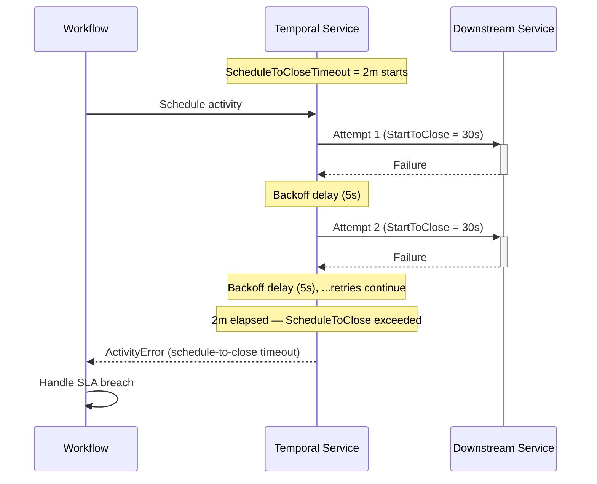

<h1>Fixed Wall-Time Retries </h1>

## Overview

The Fixed Wall-Time Retries pattern enforces a maximum total elapsed time across all Activity retry attempts using `ScheduleToCloseTimeout`.
Use it when a business process must _succeed or fail_ within a defined time budget, regardless of how many individual attempts occur.

## Problem

`StartToCloseTimeout` limits how long a single Activity attempt may run before Temporal cancels it and schedules a retry.
It does not limit how long retries collectively may run.

A process with `StartToCloseTimeout=5m` and the default unlimited retry policy can run for days — each attempt times out at 5 minutes, then Temporal waits for the backoff delay and tries again, indefinitely.

When a business SLA exists and violating that SLA is a failure such as a payment must charge in two minutes or less, an authorization check must complete within 30 seconds — you need a hard outer boundary that Temporal enforces automatically without requiring the Workflow to track elapsed time itself.

## Solution

Set `ScheduleToCloseTimeout` on the Activity call options.
It starts when the Activity is first scheduled and expires when the clock runs out, regardless of how many attempts have occurred.
If the timeout expires during an attempt, that attempt is cancelled.
If it expires between retries, the pending retry is abandoned and Temporal delivers an `ActivityError` to the Workflow.



The following describes each step:

1. The two minute budget clock starts the moment the Workflow schedules the Activity.
2. Each attempt runs up to 30 seconds (`StartToCloseTimeout`). On failure, Temporal waits the backoff delay and retries.
3. Retries continue until either the Activity succeeds or the two minute budget is exhausted.
4. When the budget expires, Temporal delivers an `ActivityError` to the Workflow, which can log, alert, or compensate.

## Implementation

### Enforcing a 2-minute SLA

Set both `schedule_to_close_timeout` (the total budget) and `start_to_close_timeout` (the per-attempt cap).
The retry policy controls the interval between attempts.
Temporal stops retrying automatically when the budget runs out.

::: code-group
```python [Python]
# workflows.py
from datetime import timedelta
from temporalio import workflow
from temporalio.common import RetryPolicy
from temporalio.exceptions import ActivityError
import activities

@workflow.defn
class PaymentAuthWorkflow:
    @workflow.run
    async def run(self, transaction_id: str) -> str:
        try:
            return await workflow.execute_activity(
                activities.authorize_transaction,
                transaction_id,
                schedule_to_close_timeout=timedelta(minutes=2),  # total budget
                start_to_close_timeout=timedelta(seconds=30),    # per attempt
                retry_policy=RetryPolicy(
                    initial_interval=timedelta(seconds=5),
                    backoff_coefficient=1.5,
                    maximum_interval=timedelta(seconds=30),
                ),
            )
        except ActivityError:
            workflow.logger.error(
                "Authorization failed — 2-minute SLA breached",
                extra={"transaction_id": transaction_id},
            )
            raise
```

```go [Go]
// workflow.go
package shipment

import (
    "time"

    "go.temporal.io/sdk/temporal"
    "go.temporal.io/sdk/workflow"
)

func PaymentAuthWorkflow(ctx workflow.Context, transactionID string) (string, error) {
    ao := workflow.ActivityOptions{
        ScheduleToCloseTimeout: 2 * time.Minute,   // total budget
        StartToCloseTimeout:    30 * time.Second,  // per attempt
        RetryPolicy: &temporal.RetryPolicy{
            InitialInterval:    5 * time.Second,
            BackoffCoefficient: 1.5,
            MaximumInterval:    30 * time.Second,
        },
    }
    ctx = workflow.WithActivityOptions(ctx, ao)

    var result string
    err := workflow.ExecuteActivity(ctx, AuthorizeTransaction, transactionID).Get(ctx, &result)
    if err != nil {
        workflow.GetLogger(ctx).Error(
            "Authorization failed — 2-minute SLA breached",
            "transactionID", transactionID,
            "error", err,
        )
        return "", err
    }
    return result, nil
}
```

```java [Java]
// ShipmentNotificationWorkflowImpl.java
import io.temporal.activity.ActivityOptions;
import io.temporal.common.RetryOptions;
import io.temporal.workflow.Workflow;
import java.time.Duration;

public class PaymentAuthWorkflowImpl implements PaymentAuthWorkflow {
    private final PaymentActivities activities = Workflow.newActivityStub(
        PaymentActivities.class,
        ActivityOptions.newBuilder()
            .setScheduleToCloseTimeout(Duration.ofMinutes(2))   // total budget
            .setStartToCloseTimeout(Duration.ofSeconds(30))     // per attempt
            .setRetryOptions(RetryOptions.newBuilder()
                .setInitialInterval(Duration.ofSeconds(5))
                .setBackoffCoefficient(1.5)
                .setMaximumInterval(Duration.ofSeconds(30))
                .build())
            .build()
    );

    @Override
    public String run(String transactionId) {
        try {
            return activities.authorizeTransaction(transactionId);
        } catch (Exception e) {
            Workflow.getLogger(getClass()).error(
                "Authorization failed — 2-minute SLA breached: " + transactionId, e
            );
            throw e;
        }
    }
}
```

```typescript [TypeScript]
// workflows.ts
import * as wf from '@temporalio/workflow';
import type * as activities from './activities';

const { authorizeTransaction } = wf.proxyActivities<typeof activities>({
    scheduleToCloseTimeout: '2m',   // total budget
    startToCloseTimeout: '30s',     // per attempt
    retry: {
        initialInterval: '5s',
        backoffCoefficient: 1.5,
        maximumInterval: '30s',
    },
});

export async function paymentAuthWorkflow(transactionId: string): Promise<string> {
    try {
        return await authorizeTransaction(transactionId);
    } catch (err) {
        wf.log.error('Authorization failed — 2-minute SLA breached', {
            transactionId,
            error: err,
        });
        throw err;
    }
}
```
:::

### Short SLA without a per-attempt timeout

For tighter budgets — such as a 30 second authorization window — you may omit `StartToCloseTimeout` and let `ScheduleToCloseTimeout` act as the only bound. 
Temporal requires at least one timeout to be set; `ScheduleToCloseTimeout` alone satisfies that requirement.

::: code-group
```python [Python]
# workflows.py
result = await workflow.execute_activity(
    activities.authorize_transaction,
    transaction_id,
    schedule_to_close_timeout=timedelta(seconds=30),
    retry_policy=RetryPolicy(
        initial_interval=timedelta(seconds=3),
        backoff_coefficient=1.5,
    ),
)
```

```go [Go]
// workflow.go
ao := workflow.ActivityOptions{
    ScheduleToCloseTimeout: 30 * time.Second,
    RetryPolicy: &temporal.RetryPolicy{
        InitialInterval:    3 * time.Second,
        BackoffCoefficient: 1.5,
    },
}
```

```java [Java]
// Workflow.java
ActivityOptions.newBuilder()
    .setScheduleToCloseTimeout(Duration.ofSeconds(30))
    .setRetryOptions(RetryOptions.newBuilder()
        .setInitialInterval(Duration.ofSeconds(3))
        .setBackoffCoefficient(1.5)
        .build())
    .build()
```

```typescript [TypeScript]
// workflows.ts
const { authorizeTransaction } = wf.proxyActivities<typeof activities>({
    scheduleToCloseTimeout: '30s',
    retry: {
        initialInterval: '3s',
        backoffCoefficient: 1.5,
    },
});
```
:::

## Best practices

- **Set both timeouts for clarity.** Use `ScheduleToCloseTimeout` as the total SLA and `StartToCloseTimeout` as a per-attempt safety valve. Omitting `StartToCloseTimeout` means a single slow response can consume the entire budget.
- **Cap `MaximumInterval` well below the SLA.** If `MaximumInterval` is 2 hours and the SLA is 24 hours, only 12 retries are possible. Tune the interval so the backoff plateaus at a value that allows meaningful retries within the budget.
- **Handle `ActivityError` explicitly.** When the SLA expires, Temporal delivers an error to the Workflow. Catch it to send an alert, trigger a compensation, or record a breach in an audit log.
- **Distinguish SLA breaches from transient errors.** Inspect the error cause — a `ScheduleToCloseTimeout` breach has a specific error type that differs from an Activity application failure.

## Common pitfalls

- **Using `StartToCloseTimeout` alone for SLA enforcement.** A downstream system that responds slowly but never fully times out can keep resetting the per-attempt clock indefinitely.
- **Setting `ScheduleToCloseTimeout` shorter than `StartToCloseTimeout`.** If the total budget is shorter than a single attempt's maximum, the Activity will never complete — Temporal will cancel it before it finishes.
- **Ignoring the breach in the Workflow.** Letting the `ActivityError` propagate without handling it means SLA breaches go unlogged and uncompensated.
- **Not accounting for backoff delays in the budget.** The total time includes both attempt durations and the backoff delays between them. A 1-hour budget with a 30-minute initial interval and coefficient 2.0 leaves room for only one or two attempts.

## Related patterns

- [Fixed Count of Retries](fixed-count-retries.md): Bound by attempt count rather than elapsed time.
- [Delayed Retry](delayed-retry.md): Fixed-interval retry when the downstream unavailability window is known.
- [Error Handling & Retry Patterns](error-handling-patterns.md): Overview and decision tree for all retry patterns.

## References

- [Activity Timeouts](https://temporal.io/blog/activity-timeouts)
- [Temporal Retry Policies](https://docs.temporal.io/encyclopedia/retry-policies)
