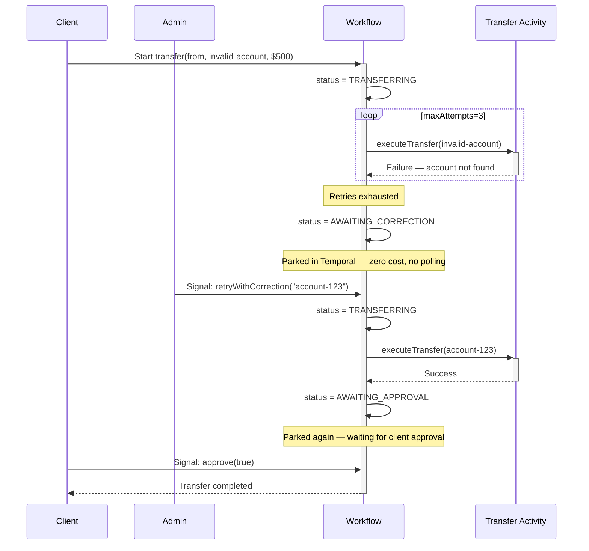
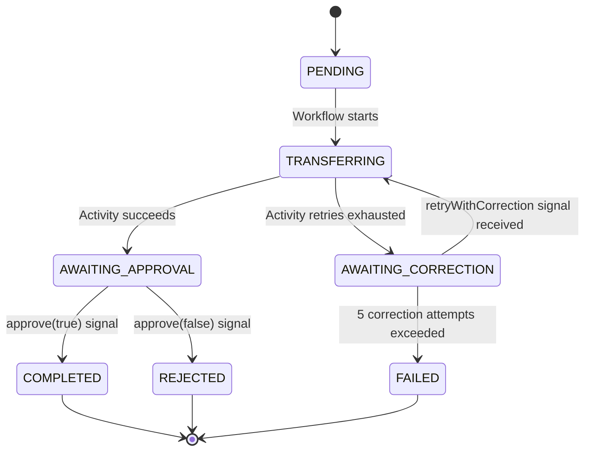

<h1>Resumable Activity (AKA Pause On Failure) </h1>

:::info TLDR
After retries are exhausted, **park the Workflow in a waiting state and block on a Signal that notifies the Workflow to proceed or optionally delivers corrected input from a human operator, then re-execute the Activity.** Use this when failures are caused by bad input that can be fixed externally — so the Workflow resumes exactly where it left off instead of being restarted from scratch.
:::

## Overview

The Resumable Activity pattern parks a Workflow, durably waiting, after Activity retries are exhausted, waits for a corrective Signal from a human operator, then re-executes the Activity with the corrected input.
Use it when failures are caused by bad input data that can be corrected externally — a wrong account number, an invalid reference, a missing record that will be created — and abandoning the Workflow is worse than pausing it.

## Problem

When an Activity fails due to bad input, retrying with the same input will never succeed.
The standard options are:

- **Fail the Workflow immediately.** The client must restart the process from scratch, often re-entering the same data that caused the failure.
- **Mark the error as non-retryable.** Same result — the Workflow fails and the client has no way to inject a correction.
- **Poll for the correction from inside the Workflow.** Wastes resources for a fix that may never come.

What you actually want is for the Workflow to *pause* — consuming zero resources — until an authorized operator provides corrected data, then *resume* exactly where it left off.
Temporal's durable execution model makes this possible without any external database, queue, or polling mechanism.

## Solution

Use a bounded `RetryPolicy` to allow a few automatic retries (in case the failure is transient), then catch the exhausted `ActivityError` in the Workflow.
Transition to an `AWAITING_CORRECTION` state and block on `workflow.wait_condition` (or equivalent).
Register a Signal handler that accepts the corrected input and unblocks the condition.
When the Signal arrives, re-execute the Activity with the corrected input.
A second Signal gates the final approval before completing.



The following describes each step:

1. The client starts the Workflow with an invalid account number.
2. The Activity fails. Temporal retries automatically up to the configured `maxAttempts`.
3. When retries are exhausted, the Workflow catches the `ActivityError` and sets its status to `AWAITING_CORRECTION`.
4. The Workflow parks itself using `wait_condition` — it consumes no CPU, no polling, no timers. Its state is fully persisted in Temporal.
5. An admin notices the problem (via Temporal UI, an alert, or an operations dashboard) and sends a `retryWithCorrection` Signal with the corrected account number.
6. The Workflow wakes up, applies the correction, and re-executes the Activity — which now succeeds.
7. The Workflow transitions to `AWAITING_APPROVAL` and parks again, waiting for the client to approve the transfer.
8. The client sends an `approve` Signal. The Workflow completes and returns the result.

The key insight: **the Workflow never died**. It survived bad input, waited indefinitely without polling, accepted an external correction, and completed cleanly. Its entire state — status, corrected account, approval decision — is durable in Temporal throughout.

## Implementation

<DaytonaRunner pattern="resumable-activity" />

### Workflow with correction and approval signals

The Workflow maintains state as named fields.
Signal handlers set the fields, and `wait_condition` blocks until they are non-null.

::: code-group
```python [Python]
# workflows.py
from dataclasses import dataclass
from datetime import timedelta
from temporalio import workflow
from temporalio.common import RetryPolicy
from temporalio.exceptions import ActivityError
import activities

@dataclass
class TransferInput:
    from_account: str
    to_account: str
    amount: float

@workflow.defn
class TransferWorkflow:
    def __init__(self) -> None:
        self._status = "PENDING"
        self._corrected_account: str | None = None
        self._approval: bool | None = None

    @workflow.run
    async def run(self, transfer: TransferInput) -> str:
        account = transfer.to_account
        correction_attempts = 0

        while True:
            self._status = "TRANSFERRING"
            try:
                result = await workflow.execute_activity(
                    activities.execute_transfer,
                    TransferInput(transfer.from_account, account, transfer.amount),
                    start_to_close_timeout=timedelta(seconds=30),
                    retry_policy=RetryPolicy(maximum_attempts=3),
                )
                break  # Activity succeeded — exit the correction loop
            except ActivityError:
                correction_attempts += 1
                if correction_attempts > 5:
                    self._status = "FAILED"
                    raise
                self._status = "AWAITING_CORRECTION"
                workflow.logger.warning(
                    "Transfer failed — waiting for account correction",
                    extra={"to_account": account},
                )
                # Park until the admin sends a correction signal
                await workflow.wait_condition(
                    lambda: self._corrected_account is not None
                )
                account = self._corrected_account
                self._corrected_account = None

        self._status = "AWAITING_APPROVAL"
        await workflow.wait_condition(lambda: self._approval is not None)

        if self._approval:
            self._status = "COMPLETED"
            return f"Transfer of {transfer.amount} to {account} completed"
        self._status = "REJECTED"
        return "Transfer rejected by client"

    @workflow.signal
    def retry_with_correction(self, corrected_account: str) -> None:
        self._corrected_account = corrected_account

    @workflow.signal
    def approve(self, approved: bool) -> None:
        self._approval = approved

    @workflow.query
    def get_status(self) -> str:
        return self._status
```

```go [Go]
// workflow.go
package transfer

import (
    "fmt"
    "time"

    "go.temporal.io/sdk/temporal"
    "go.temporal.io/sdk/workflow"
)

type TransferInput struct {
    FromAccount string
    ToAccount   string
    Amount      float64
}

func TransferWorkflow(ctx workflow.Context, input TransferInput) (string, error) {
    status := "PENDING"
    if err := workflow.SetQueryHandler(ctx, "getStatus", func() (string, error) {
        return status, nil
    }); err != nil {
        return "", err
    }

    correctionCh := workflow.GetSignalChannel(ctx, "retryWithCorrection")
    approvalCh := workflow.GetSignalChannel(ctx, "approve")

    ao := workflow.ActivityOptions{
        StartToCloseTimeout: 30 * time.Second,
        RetryPolicy: &temporal.RetryPolicy{MaximumAttempts: 3},
    }
    actCtx := workflow.WithActivityOptions(ctx, ao)

    account := input.ToAccount
    correctionCount := 0
    for {
        status = "TRANSFERRING"
        err := workflow.ExecuteActivity(actCtx, ExecuteTransfer, TransferInput{
            FromAccount: input.FromAccount,
            ToAccount:   account,
            Amount:      input.Amount,
        }).Get(actCtx, nil)

        if err == nil {
            break // Activity succeeded — exit the correction loop
        }

        correctionCount++
        if correctionCount > 5 {
            status = "FAILED"
            return "", err
        }
        status = "AWAITING_CORRECTION"
        workflow.GetLogger(ctx).Warn("Transfer failed — waiting for account correction",
            "to_account", account)

        // Park until the admin sends a correction signal
        var corrected string
        _ = workflow.Await(ctx, func() bool {
            return correctionCh.ReceiveAsync(&corrected)
        })
        account = corrected
    }

    status = "AWAITING_APPROVAL"
    var approved bool
    _ = workflow.Await(ctx, func() bool {
        return approvalCh.ReceiveAsync(&approved)
    })

    if approved {
        status = "COMPLETED"
        return fmt.Sprintf("Transfer of %.2f to %s completed", input.Amount, account), nil
    }
    status = "REJECTED"
    return "Transfer rejected by client", nil
}
```

```java [Java]
// TransferWorkflowImpl.java
import io.temporal.activity.ActivityOptions;
import io.temporal.common.RetryOptions;
import io.temporal.failure.ActivityFailure;
import io.temporal.workflow.SignalMethod;
import io.temporal.workflow.QueryMethod;
import io.temporal.workflow.WorkflowInterface;
import io.temporal.workflow.WorkflowMethod;
import io.temporal.workflow.Workflow;
import java.time.Duration;

@WorkflowInterface
public interface TransferWorkflow {
    @WorkflowMethod
    String run(TransferInput input);

    @SignalMethod
    void retryWithCorrection(String correctedAccount);

    @SignalMethod
    void approve(boolean approved);

    @QueryMethod
    String getStatus();
}

public class TransferWorkflowImpl implements TransferWorkflow {
    private String status = "PENDING";
    private String correctedAccount;
    private Boolean approval;

    private final TransferActivities activities = Workflow.newActivityStub(
        TransferActivities.class,
        ActivityOptions.newBuilder()
            .setStartToCloseTimeout(Duration.ofSeconds(30))
            .setRetryOptions(RetryOptions.newBuilder()
                .setMaximumAttempts(3)
                .build())
            .build()
    );

    @Override
    public String run(TransferInput input) {
        String account = input.getToAccount();
        int correctionCount = 0;

        while (true) {
            status = "TRANSFERRING";
            try {
                activities.executeTransfer(
                    new TransferInput(input.getFromAccount(), account, input.getAmount())
                );
                break; // Activity succeeded — exit the correction loop
            } catch (ActivityFailure e) {
                correctionCount++;
                if (correctionCount > 5) {
                    status = "FAILED";
                    throw e;
                }
                status = "AWAITING_CORRECTION";
                Workflow.getLogger(getClass()).warn(
                    "Transfer failed — waiting for account correction: " + account
                );
                // Park until the admin sends a correction signal
                Workflow.await(() -> correctedAccount != null);
                account = correctedAccount;
                correctedAccount = null;
            }
        }

        status = "AWAITING_APPROVAL";
        Workflow.await(() -> approval != null);

        if (approval) {
            status = "COMPLETED";
            return String.format("Transfer of %.2f to %s completed", input.getAmount(), account);
        }
        status = "REJECTED";
        return "Transfer rejected by client";
    }

    @Override
    public void retryWithCorrection(String account) {
        this.correctedAccount = account;
    }

    @Override
    public void approve(boolean decision) {
        this.approval = decision;
    }

    @Override
    public String getStatus() {
        return status;
    }
}
```

```typescript [TypeScript]
// workflows.ts
import * as wf from '@temporalio/workflow';
import type * as activities from './activities';

export interface TransferInput {
    fromAccount: string;
    toAccount: string;
    amount: number;
}

export const retryWithCorrectionSignal = wf.defineSignal<[string]>('retryWithCorrection');
export const approveSignal = wf.defineSignal<[boolean]>('approve');
export const getStatusQuery = wf.defineQuery<string>('getStatus');

const { executeTransfer } = wf.proxyActivities<typeof activities>({
    startToCloseTimeout: '30s',
    retry: { maximumAttempts: 3 },
});

export async function transferWorkflow(input: TransferInput): Promise<string> {
    let status = 'PENDING';
    let correctedAccount: string | undefined;
    let approval: boolean | undefined;

    wf.setHandler(retryWithCorrectionSignal, (account: string) => {
        correctedAccount = account;
    });
    wf.setHandler(approveSignal, (decision: boolean) => {
        approval = decision;
    });
    wf.setHandler(getStatusQuery, () => status);

    let account = input.toAccount;
    let correctionCount = 0;

    while (true) {
        status = 'TRANSFERRING';
        try {
            await executeTransfer({ ...input, toAccount: account });
            break; // Activity succeeded — exit the correction loop
        } catch (err) {
            correctionCount++;
            if (correctionCount > 5) {
                status = 'FAILED';
                throw err;
            }
            status = 'AWAITING_CORRECTION';
            wf.log.warn('Transfer failed — waiting for account correction', { account });
            // Park until the admin sends a correction signal
            await wf.condition(() => correctedAccount !== undefined);
            account = correctedAccount!;
            correctedAccount = undefined;
        }
    }

    status = 'AWAITING_APPROVAL';
    await wf.condition(() => approval !== undefined);

    if (approval) {
        status = 'COMPLETED';
        return `Transfer of ${input.amount} to ${account} completed`;
    }
    status = 'REJECTED';
    return 'Transfer rejected by client';
}
```
:::

### Sending signals

An operator sends the correction Signal using the Temporal CLI or any SDK client.
The Workflow wakes immediately when the Signal is delivered.

```bash
# Correct the account number
temporal workflow signal \
  --workflow-id transfer-wf-001 \
  --name retryWithCorrection \
  --input '"account-123"'

# Approve the transfer
temporal workflow signal \
  --workflow-id transfer-wf-001 \
  --name approve \
  --input 'true'
```

## State Diagram

The Workflow transitions through a well-defined set of states.
Query `getStatus` at any time to observe the current state.



## Best practices

- **Use a bounded `MaximumAttempts` before parking.** Allow a few automatic retries to recover from transient failures. Parking immediately on the first failure forces operators to intervene for problems that would have resolved on their own.
- **Cap the correction loop.** Each correction cycle — park, receive signal, re-execute Activity — adds events to the Workflow history (signal received, state transitions, Activity scheduled/completed). Bound the loop to a small number of attempts (the examples use 5) and fail the Workflow explicitly if exceeded, rather than allowing unbounded growth from a stream of bad corrections.
- **Expose status via a Query method.** The `getStatus` Query gives operations tooling visibility into where the Workflow is parked without requiring access to the Workflow history.
- **Validate the correction in the Signal handler.** Check that the corrected account is non-empty and matches the expected format before setting the state. An invalid correction just parks the Workflow again, but a clear error message helps operators.
- **Log at every state transition.** The `AWAITING_CORRECTION` and `AWAITING_APPROVAL` states can last hours or days. Structured log lines at each transition make the audit trail clear.
- **Notify the operator proactively.** The `AWAITING_CORRECTION` transition is a good point to send an alert — an email, a Slack message, or a ticket — rather than waiting for the operator to notice in the Temporal UI.
- **Distinguish this from the Approval pattern.** The [Approval](approval.md) pattern gates forward progress on a human decision. This pattern recovers from failure with a human-supplied data correction. Both use Signals and `wait_condition`, but serve different roles in a process.

## Common pitfalls

- **Waiting without a timeout.** If operators never send the correction Signal, the Workflow waits indefinitely. Add durable timer if the process must resolve within a time bound.
- **Not clearing the correction state before re-entering the loop.** After applying the correction, set `corrected_account = None` (or equivalent) before the next Activity attempt. Otherwise, if the corrected activity also fails, the Workflow immediately re-uses the previous correction instead of waiting for a new one.
- **Accepting corrections in the wrong state.** If a Signal arrives while the Activity is running (not parked), the correction should be queued and applied after the current attempt completes. The Signal handler always runs — the condition check (`wait_condition`) determines when the Workflow acts on it.
- **Conflating the correction loop with a general retry loop.** This pattern is for correcting *input data*. For retrying the same call against a temporarily unavailable system, use [Fast/Slow Retries](fast-slow-retries.md) instead.

## Related patterns

- [Approval](approval.md): Human-in-the-loop gate for forward progress rather than failure recovery.
- [Non-Retryable Errors](non-retryable-errors.md): Fail immediately without parking when the error is structural and no correction is expected.
- [Fast/Slow Retries](fast-slow-retries.md): Infinite patient retries when the downstream system is temporarily unavailable.
- [Signal with Start](signal-with-start.md): Start the Workflow and send the correction Signal atomically.
- [Error Handling & Retry Patterns](error-handling-patterns.md): Overview and decision tree for all retry patterns.
